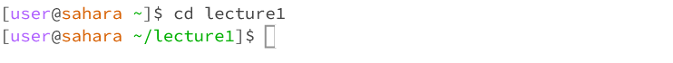
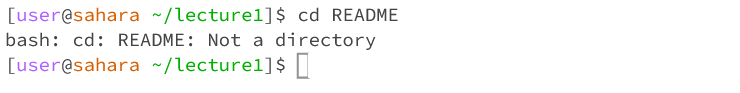
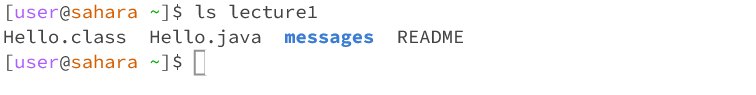
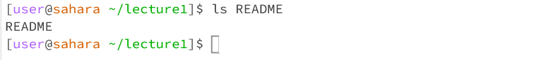
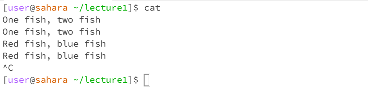
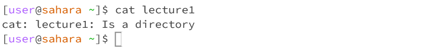
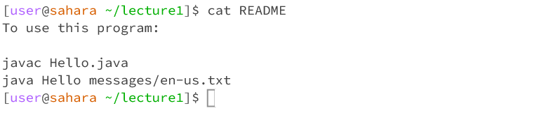

# cd
### no argument:

Working directory: /home/lecture1

This output is swell!

no error

---
### directory:

Working directory: /home

This output is swell!

no error

---
### file:

Working directory: /home/lecture1

This output is swell!

no error

---
# ls
### no argument:

Working directory: /home

This output is swell!

no error

---
### directory:

Working directory: /home

This output is swell!

no error

---
### file:

Working directory: /home/lecture1

This output is swell!

no error

---
# cat
### no argument:

Working directory: /home/lecture1

This output is swell!

no error

---
### directory:

Working directory: /home

This output is swell!

no error

---
### file:

Working directory: /home/lecture1

This output is swell!

no error
