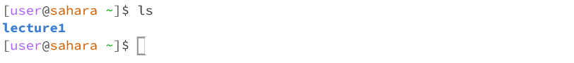

# cd
### no arguments:

Working directory: `/home/lecture1`

Running the `cd` command with no arguments sets the `home` directory as the current working directory.

This command executed with no errors.

---
### directory:

Working directory: `/home`

Running the `cd` command with a path to a directory as the argument sets that directory as the current working directory. The command was run from the `home` directory, which contains the `lecture1` directory. As such, the `cd` command successfully set `lecture1` as the current working directory.

This command executed with no errors.

---
### file:

Working directory: `/home/lecture1`

Running the `cd` command with a path to a file as the argument failed to change the current working directory, and instead printed out a line of text indicating that `README` is not a directory.

This output is an error, as the `cd` command is only meant to take directories as arguments.

---
# ls
### no arguments:

Working directory: `/home`

Running the `ls` command with no arguments displays the contents of the current working directory. The command was run from the `home` directory, which only contains the `lecture1` directory. As such, the `ls` command successfully displayed the contents of the current directory.

This command executed with no errors.

---
### directory:

Working directory: `/home`

Running the `ls` command with a path to a directory as the argument displays the contents of that directory. The command was run from the `home` directory, which contains the `lecture1` directory. As such, the `ls` command successfully displayed the contents of the `lecture1` directory.

This command executed with no errors.

---
### file:

Working directory: `/home/lecture1`

Running the `ls` command with a path to a file as the argument displays the name of that file. The command was run from the `lecture1` directory, which contains the `README` file. As such, the `ls` command successfully displayed the name of the `README` file.

This command executed with no errors.

---
# cat
### no arguments:

Working directory: `/home/lecture1`

Running the `cat` command with no arguments causes the command to operate on user input. The command will continue to echo the user's input until it is forced to terminate via `Ctrl+C`.

This command executed with no errors.

---
### directory:

Working directory: `/home`

Running the `cat` command with a path to a directory as the argument failed to print the contents of any file, and instead printed out a line of text indicating that `lecture1` is a directory.

This output is an error, as the `cat` command is only meant to take files as arguments.

---
### file:

Working directory: `/home/lecture1`

Running the `cat` command with a path to a file as the argument displays the contents of that file. The command was run from the `lecture1` directory, which contains the `README` file. As such, the `cat` command successfully displayed the contents of the `README` file.

This command executed with no errors.
