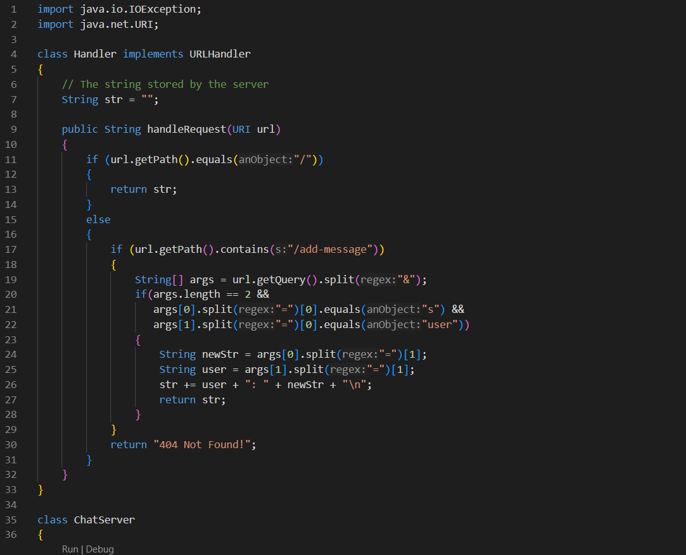
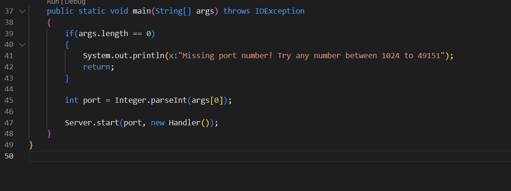
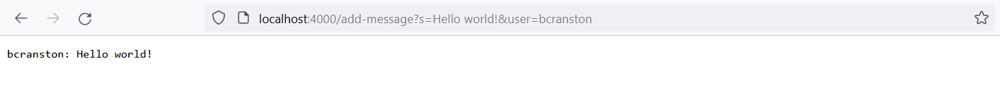
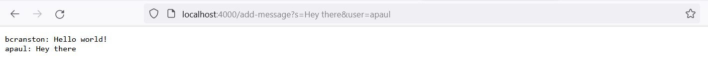
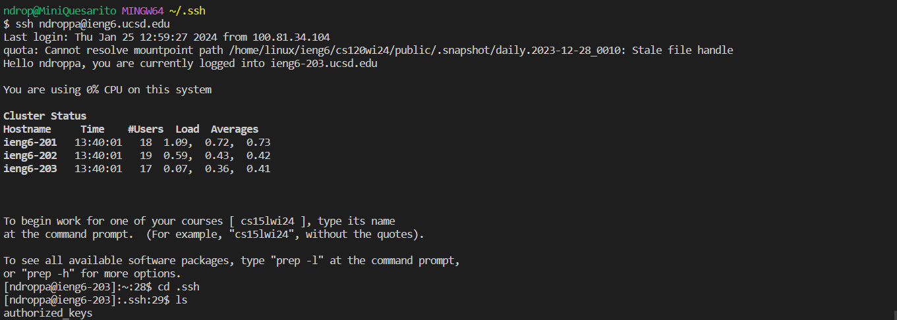

# Part 1
### contents of `ChatServer.java`:

---
### using `/add-message`:

Whenever the page is accessed the `handleRequest()` method is called, and the URL is passed to this method as an argument. The behavior of this method depends on the contents of the URL's path. If the path contains the `/add-message` argument, then text is appended to the `str` field, which is initally empty. The text that is appended is determined by the contents of the `/add-message` argument. After the first usage of `/add-message`, the text `bcranston: Hello world!` is appended to `str`, followed by a newline character. The next usage of the `/add-message` argument appends the text `apaul: Hey there` to `str`, along with another newline. In either case, after the text has been appended, the method returns `str` so that it is displayed by the webpage.

---
# Part 2
### private key:

---
### public key:

---
### logging into `ieng6`:

---
# Part 3
### something I learned:

In this lab, I learned several things about remote terminal connections. The `scp` command is a useful way to copy files from one machine to another without relying on third-party services. Also, the ability to generate SSH keys so that I don't have to type my password every time I make a remote connection is an extremely helpful time-saver.
