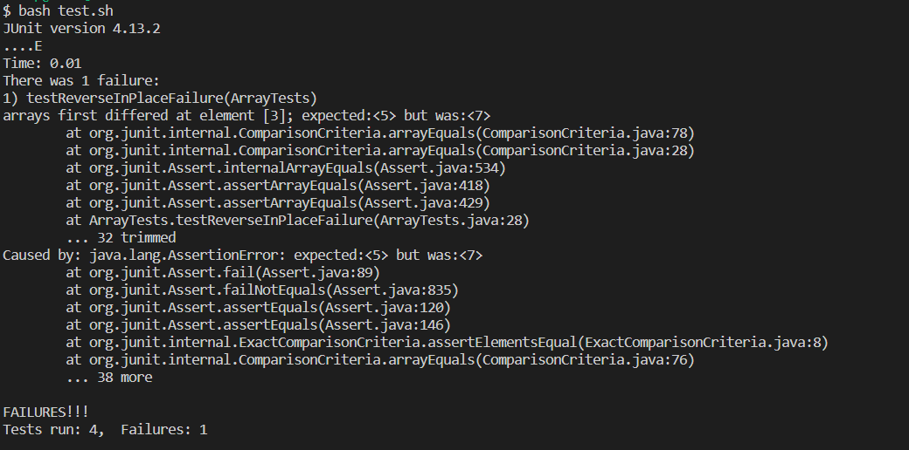

# Part 1
### failure-inducing input:

```
@Test 
public void testReverseInPlaceFailure()
{
	int[] input1 = { 3, 5, 4, 7, 6 };
	ArrayExamples.reverseInPlace(input1);
	assertArrayEquals(new int[]{ 6, 7, 4, 5, 3 }, input1);
}
```
---
### successful input:

```
@Test 
public void testReverseInPlaceSuccess()
{
	int[] input1 = { 3, 2, 1, 2, 3 };
	ArrayExamples.reverseInPlace(input1);
	assertArrayEquals(new int[]{ 3, 2, 1, 2, 3 }, input1);
}
```
---
### the symptom:



---
### the bug:

Before:
```
static void reverseInPlace(int[] arr)
{
	for(int i = 0; i < arr.length; i += 1)
	{
		arr[i] = arr[arr.length - i - 1];
	}
}
```

After:
```
static void reverseInPlace(int[] arr)
{
	int tempArr[] = new int[arr.length];
	for(int i = 0; i < arr.length; i += 1)
	{
		tempArr[i] = arr[arr.length - i - 1];
	}
	for(int i = 0; i < arr.length; i += 1)
	{
		arr[i] = tempArr[i];
	}
}
```

Explanation:
To understand the problem with the original code, consider what happens on the first and final iteration of the `for` loop. In the first iteration, the first element of the array is replaced with the last element. In the final iteration, the final element in the array is replaced by the first element; but the first element was already replaced with the final element! That means the final element isn't actually changed at all, and this same issue applies to every element in the back half of the array. To fix this issue, the new code uses a temporary array to place the elements in the correct order, then copies the contents of that array over the original array.

---
# Part 2

## options to use with the `find` command:
### using `| head`:
```
$ find biomed/ | head
biomed/
biomed/1468-6708-3-1.txt
biomed/1468-6708-3-10.txt
biomed/1468-6708-3-3.txt
biomed/1468-6708-3-4.txt
biomed/1468-6708-3-7.txt
biomed/1471-2091-2-10.txt
biomed/1471-2091-2-11.txt
biomed/1471-2091-2-12.txt
biomed/1471-2091-2-13.txt
```
```
$ find plos/ | head
plos/
plos/journal.pbio.0020001.txt
plos/journal.pbio.0020010.txt
plos/journal.pbio.0020012.txt
plos/journal.pbio.0020013.txt
plos/journal.pbio.0020019.txt
plos/journal.pbio.0020028.txt
plos/journal.pbio.0020035.txt
plos/journal.pbio.0020040.txt
plos/journal.pbio.0020042.txt
```

By default, the `find` command will print out all results found. When searching large directories, this can flood the terminal with hundreds of lines of text. By using the `|` symbol, we can instead use that output as the input to another command. The `head` command is used to display a certain number of lines of its input; by default, it will display 10 lines.

Source: https://stackoverflow.com/questions/54570574/how-to-display-exactly-10-lines-of-a-command-output

---
### using `-type`:
```
$ find biomed/ -type f | head
biomed/1468-6708-3-1.txt
biomed/1468-6708-3-10.txt
biomed/1468-6708-3-3.txt
biomed/1468-6708-3-4.txt
biomed/1468-6708-3-7.txt
biomed/1471-2091-2-10.txt
biomed/1471-2091-2-11.txt
biomed/1471-2091-2-12.txt
biomed/1471-2091-2-13.txt
biomed/1471-2091-2-16.txt
```
```
$ find government/ -type d
government/
government/About_LSC
government/Alcohol_Problems
government/Env_Prot_Agen
government/Gen_Account_Office
government/Media
government/Post_Rate_Comm
```

The `-type` option can be used to search for specific results. Using `-find f` will search for files, whereas using `-find d` will search for directories.

Source: https://tecadmin.net/linux-find-command-with-examples/

---
### using `-size`:
```
$ find government/ -size 10k
government/Gen_Account_Office/og96014.txt
government/Gen_Account_Office/og96023.txt
government/Gen_Account_Office/og96037.txt
government/Gen_Account_Office/og96040.txt
government/Gen_Account_Office/og96047.txt
government/Gen_Account_Office/og97039.txt
government/Gen_Account_Office/og97051.txt
government/Gen_Account_Office/og97052.txt
government/Media/Farm_workers.txt
government/Media/Survey.txt
```
```
$ find plos/ -size +30k
plos/pmed.0010028.txt
plos/pmed.0010036.txt
plos/pmed.0020018.txt
plos/pmed.0020045.txt
plos/pmed.0020059.txt
plos/pmed.0020073.txt
plos/pmed.0020103.txt
plos/pmed.0020182.txt
plos/pmed.0020246.txt
plos/pmed.0020249.txt
```

The `-size` option can be used to search for files with a specific size. The number following `-size` determines the size to search for. For example, `-size 10k` searches for files with a size of 10 kilobytes. Using the `+` or `-` prefix on the file size will give results that are larger or smaller than the specified size.

Source: https://tecadmin.net/linux-find-command-with-examples/

---
### using `-mtime`:
```
$ find 911report/ -mtime 4 | head
911report/
911report/chapter-1.txt
911report/chapter-10.txt
911report/chapter-11.txt
911report/chapter-12.txt
911report/chapter-13.1.txt
911report/chapter-13.2.txt
911report/chapter-13.3.txt
911report/chapter-13.4.txt
911report/chapter-13.5.txt
```
```
$ find plos/ -mtime +1 | head
plos/
plos/journal.pbio.0020001.txt
plos/journal.pbio.0020010.txt
plos/journal.pbio.0020012.txt
plos/journal.pbio.0020013.txt
plos/journal.pbio.0020019.txt
plos/journal.pbio.0020028.txt
plos/journal.pbio.0020035.txt
plos/journal.pbio.0020040.txt
plos/journal.pbio.0020042.txt
```

The `-mtime` option can be used to search for files based on their modification time. For example, `-mtime 4` searches for files that were modified 4 days ago. The `+` and `-` prefixes can be used in a similar manner as `-size` to find files that were modified more or less than the specified number of days ago.

Source: https://tecadmin.net/linux-find-command-with-examples/
