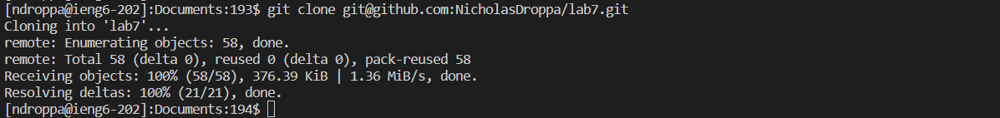
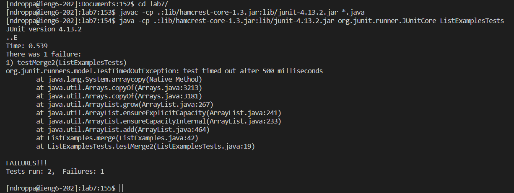
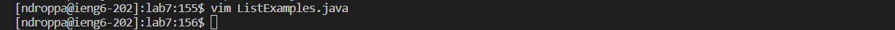
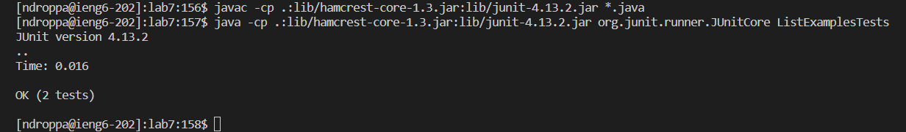

# Step 4:

**Keys pressed:** `ssh ndroppa@ieng6.ucsd.edu<enter>`  
The `ssh` command was used to establish a remote connection to my ieng6 machine.

# Step 5:

**Keys pressed:** `cd Doc<tab><enter>`, `git clone <ctrl+v><enter>`  
The `cd` command was used to change to the documents directory. Instead of typing the full name of the directory, I typed the first three letters and pressed `<tab>` to fill in the rest. Then, I input `git clone` to clone my repository, using `<ctrl+v>` to paste the location that I copied from my browser.

# Step 6:

**Keys pressed:** `cd <tab><enter>`, `<ctrl+v><enter>`, `<ctrl+v> L<tab>T<tab><backspace><enter>`  
Again, `cd` was used to change the current directory, `<ctrl+v>` was used to paste commnands that I copied from my browser, and `<tab>` was used to autocomplete where possible.

# Step 7:

**Keys pressed:** `vim L<tab>.<tab><enter>`, `44Gwhi<backspace>2<esc>:wq<enter>`  
The `vim` command was used to open the file, and the rest of the key presses were performed within the editor. `44G` jumped to line 44, `w` jumped to the next word, `h` moved the coursor back one space, `i` entered insert mode, `<backspace>` deleted the previous character, `2` inserted that character, `<esc>` exited insert mode, and `:wq<enter>` saved my changes and closed the file.

# Step 8:

**Keys pressed:** `<up><up><up><enter>`, `<up><up><up><enter>`  
The commands I needed were already in my history, so I used the `<up>` key to access them.

# Step 9:

**Keys pressed:** `git add -A<enter>`, `git commit -m 'bugfix'<enter>`, `git push<enter>`  
The `git add -A` command added all changed files, the `git commit` command commited those changes with the `-m 'bugfix'` option specifying the commit message, and the `git push` command pushed the changes to the repository.
